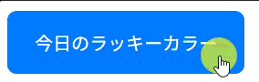

## ボタン練習問題２

以下のHTML/CSSをみて、実行結果の通りになるようJavaScriptコードを追加してください。

```HTML
<!doctype html>
<html>
  <head>
    <title>Button_2</title>
    <link rel="stylesheet" href="style.css" />
    <script src="script.js" defer></script>
  </head>

  <body>
    <button id="lucky-color-button">今日のラッキーカラー</button>
  </body>
</html>

```

```CSS
#lucky-color-button {
    padding: 1rem 1.5rem;
    font-size: 1rem;
    border: none;
    border-radius: 8px;
    background-color: #07f;
    color: #fff;
    cursor: pointer;
    transition: background-color 0.1s ease;
}
```

[実行結果]
<br>


<details>
<summary>小ヒント💡</summary>

以下のイベントの時に関数を実行します。
- click : 要素がクリックされた時に発生する

</details>

<details>
<summary>中ヒント💡💡</summary>

以下のメソッドを組み合わせて処理を実装します。
- querySelector() : 要素の取得
- addEventListener() : イベントの設定
- Math.floor() : 小数点以下を切り捨て整数値を得る
- Math.random() : 0.0 ~ 1.0 の間でランダムな数値を得る
- toString() : 文字列表現を得る

</details>

<details>
<summary>大ヒント💡💡💡</summary>

以下のような流れで処理を実装します。
```JS
// 1. lucky-color-buttonというIDを持つbutton要素を取得
// 2. 1で取得したbutton要素にclickイベントを追加
// 3. ランダムな16進数のカラーコードを取得（例：「01bd3f」）
// 4. 3で取得したカラーコードを「#01bd3f」の様な文字列に成形
// 5. button要素のbackgroundColorを押された時の色に変更
```

</details>

<details>
<summary>解答例</summary>

```JS
const btn = document.querySelector("#lucky-color-button");
btn.addEventListener("click", () => {
    const randCode = Math.floor(Math.random() * 16777215).toString(16);
    const color = `#${randCode}`;
    btn.style.backgroundColor = color;
});
```

</details>
