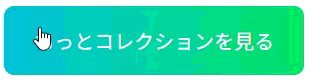

## ボタン練習問題３

以下のHTML/CSSをみて、実行結果の通りになるようJavascriptコードを追加してください。

```HTML
<!doctype html>
<html>
  <head>
    <title>Button_3</title>
    <link rel="stylesheet" href="style.css" />
    <script src="script.js" defer></script>
  </head>

  <body>
    <button id="more-collection-button">もっとコレクションを見る</button>
  </body>
</html>

```

```CSS
#more-collection-button {
    padding: 1rem 1.5rem;
    font-size: 1rem;
    border: none;
    border-radius: 8px;
    color: white;
    background: linear-gradient(90deg, #0bd, #0f0);
    background-size: 200% 100%;
    cursor: pointer;
    transition: background-position 0.2s ease;
}
```

[実行結果]
<br>


<details>
<summary>解答例</summary>

```JS
const btn = document.querySelector("#more-collection-button");
btn.addEventListener("mousemove", (e) => {
    const rect = btn.getBoundingClientRect();
    const x = ((e.clientX - rect.left) / rect.width) * 100;
    btn.style.backgroundPosition = `${x}% 0`;
});
btn.addEventListener("mouseleave", () => {
    btn.style.backgroundPosition = "0% 0";
});
```

</details>
