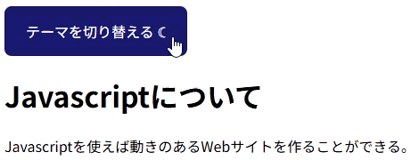

## ボタン練習問題４

以下のHTML/CSSをみて、実行結果の通りになるようJavascriptコードを追加してください。

```HTML
<!doctype html>
<html>
  <head>
    <title>Button_4</title>
    <link rel="stylesheet" href="style.css" />
    <script src="script.js" defer></script>
  </head>

  <body>
    <button id="theme-button">
      テーマを切り替える&nbsp;<span id="icon">☾</span>
    </button>
    <p>Javascriptを使えば動きのあるWebサイトを作ることができる。</p>
  </body>
</html>
```

```CSS
body {
  transition: 0.5s;
}
#theme-button {
  padding: 1rem 1.5rem;
  font-size: 1rem;
  border: none;
  border-radius: 8px;
  color: #ffffff;
  background: #191970;
  background-size: 200% 100%;
  cursor: pointer;
  transition: background-position 0.2s ease;
}
.dark-theme {
  background: #000000;
  color: #dddddd;
}
```

[実行結果]
<br>


<details>
<summary>解答例</summary>

```JS
const btn = document.querySelector("#theme-button");
const icon = document.querySelector("#icon");

btn.addEventListener("click", () => {
    const classList = document.body.classList;
    document.body.classList.toggle("dark-theme");

    if (classList.contains("dark-theme")) {
        icon.textContent = "☼";
        btn.style.background = "#ffa500";
    } else {
        icon.textContent = "☾";
        btn.style.background = "#191970";
    }
});
```

</details>
