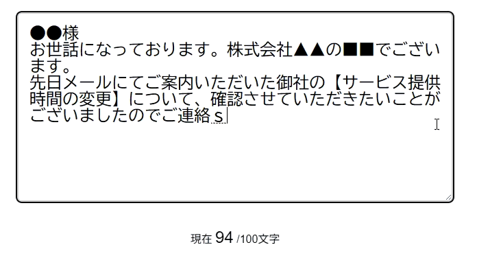

## フォーム練習問題１

以下のHTML/CSSをみて、実行結果の通りになるようJavaScriptコードを追加してください。

```HTML
<!doctype html>
<html>
  <head>
    <title>Form_1</title>
    <link rel="stylesheet" href="style.css" />
    <script src="script.js" defer></script>
  </head>

  <body>
    <textarea id="inquiry-detail"></textarea>
    <p>現在 <span id="count">0</span> /100文字</p>
  </body>
</html>
```

```CSS
body {
  text-align: center;
  padding: 2rem;
}
#inquiry-detail {
  border: 4px solid #ccc;
  border-radius: 8px;
  width: 600px;
  height: 240px;
  max-width: 100%;
  font-size: 1.5rem;
  padding: 1rem;
  margin-bottom: 1rem;
}
#count {
  font-size: 1.5rem;
}
.alert-border {
  border-color: #f66 !important;
}
.alert {
  color: #f66;
}
```

[実行結果]
<br>


<details>
<summary>小ヒント💡</summary>

以下のイベントの時に関数を実行します。
- keyup : キーが離されたときに関数を実行する

</details>

<details>
<summary>中ヒント💡💡</summary>

以下のメソッドを組み合わせて処理を実装します。
- querySelector() : 要素の取得
- addEventListener() : イベントの設定
- add() : （クラスなどの）追加を行う
- remove() : （クラスなどの）削除を行う

</details>

<details>
<summary>大ヒント💡💡💡</summary>

以下のような流れで処理を実装します。
```JS
// 1. inquiry-detailというIDを持つtextarea要素を取得
// 2. countというIDを持つspan要素を取得
// 3. 1で取得したtextarea要素にkeyupイベントを追加
// 4. 2で取得したspan要素のtextContentにtextarea要素の文字列の長さを設定する
// 5. textarea要素の文字列の長さが100を超えていたら >> a
// 5-a-1. textarea要素のclassListにalert-borderクラスを追加
// 5-a-2. span要素のclassListにalertクラスを追加
// 5. それ以外の場合 >> b
// 5-b-1. textarea要素のclassListからalert-borderクラスを削除
// 5-b-2. span要素のclassListからalertクラスを削除
```

</details>

<details>
<summary>解答例</summary>

```JS
const inquiryText = document.querySelector("#inquiry-detail");
const count = document.querySelector("#count");

inquiryText.addEventListener("keyup", () => {
    count.textContent = inquiryText.value.length;

    if (inquiryText.value.length > 100) {
        inquiryText.classList.add("alert-border");
        count.classList.add("alert");
    } else {
        inquiryText.classList.remove("alert-border");
        count.classList.remove("alert");
    }
});
```

</details>
