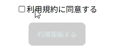

## フォーム練習問題２

以下のHTML/CSSをみて、実行結果の通りになるようJavaScriptコードを追加してください。

```HTML
<!doctype html>
<html>
  <head>
    <title>Form_1</title>
    <link rel="stylesheet" href="style.css" />
    <script src="script.js" defer></script>
  </head>

  <body>
    <form>
      <label><input id="check" type="checkbox" />利用規約に同意する</label>
      <input id="submit-button" type="submit" value="利用開始する" disabled />
    </form>
  </body>
</html>
```

```CSS
body {
  text-align: center;
  padding: 2rem;
}
label {
  display: block;
  margin-bottom: 1rem;
}
#submit-button {
  background: #1d8;
  color: #ddd;
  padding: 0.75rem 1rem;
  border: 2px solid #ccc;
  border-radius: 8px;
}
#submit-button:disabled {
  background: #ccc;
}
```

[実行結果]
<br>


<details>
<summary>解答例</summary>

```JS
const isAgreed = document.querySelector("#check");
const submitButton = document.querySelector("#submit-button");

isAgreed.addEventListener("change", () => {
    submitButton.disabled = !isAgreed.checked;
});
```

</details>
