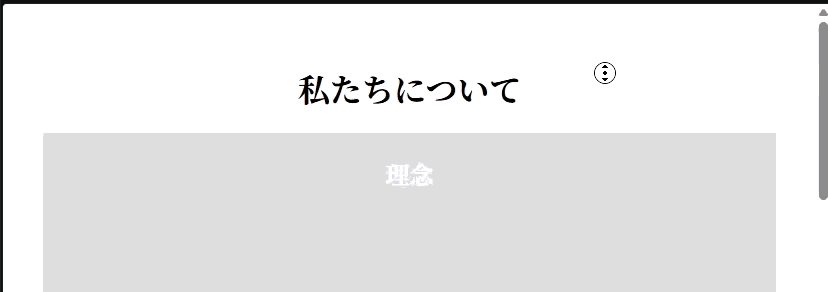

## ユーティリティ練習問題１

以下のHTML/CSSをみて、実行結果の通りになるようJavaScriptコードを追加してください。

```HTML
<!doctype html>
<html>
  <head>
    <title>Utility_1</title>
    <link rel="stylesheet" href="style.css" />
    <script src="script.js" defer></script>
  </head>

  <body>
    <div id="progress-bar"></div>
    <article>
      <h1>私たちについて</h1>
      <div class="article-content">
        <h2>理念</h2>
      </div>
      <div class="article-content">
        <h2>歴史</h2>
      </div>
      <div class="article-content">
        <h2>会社</h2>
      </div>
      <div class="article-content">
        <h2>これから</h2>
      </div>
      <div class="article-content">
        <h2>アクセス</h2>
      </div>
    </article>
  </body>
</html>
```

```CSS
body {
  font-family: serif;
  text-align: center;
}
#progress-bar {
  background-color: #adf;
  position: fixed;
  top: 0;
  left: 0;
  height: 10px;
}
article {
  max-width: 800px;
  margin: auto;
  padding: 2rem;
}
.article-content {
  padding-top: 0.2rem;
  margin-bottom: 2rem;
  background-color: #ddd;
  color: #fff;
  height: 800px;
}
```

[実行結果]
<br>


<details>
<summary>小ヒント💡</summary>

以下のイベントの時に関数を実行します。
- scroll : スクロールされた時に関数を実行する

</details>

<details>
<summary>中ヒント💡💡</summary>

以下のメソッドを組み合わせて処理を実装します。
- querySelector() : 要素の取得
- addEventListener() : イベントの設定

</details>

<details>
<summary>大ヒント💡💡💡</summary>

以下のような流れで処理を実装します。
```JS
// 1. スクロール量をパーセンテージで取得するメソッドを定義
// 1-1. windowオブジェクトからスクロール量（y成分）を取得
// 1-2. documentElementのスクロール可能な高さを取得
// 1-3. documentElementのビューポートの高さを取得
// 1-4. 1-1で取得したスクロール量を1-3と1-4の差分で除算し現在の進捗率を計算
// 1-5. progress-barというIDのdiv要素を取得
// 1-6. 1-5で取得したdiv要素のwidthに1-5で計算した進捗率を設定
// 2. windowオブジェクトに1で定義したメソッドでscrollイベントを追加
```

</details>

<details>
<summary>解答例</summary>

```JS
const getScrollPercent = () => {
    const scrolled = window.scrollY;
    const pageHeight = document.documentElement.scrollHeight;
    const viewHeight = document.documentElement.clientHeight;
    const percentage = scrolled / (pageHeight - viewHeight) * 100;

    const progressBar = document.querySelector("#progress-bar");
    progressBar.style.width = `${percentage}%`;
};

window.addEventListener("scroll", getScrollPercent);
```

</details>
