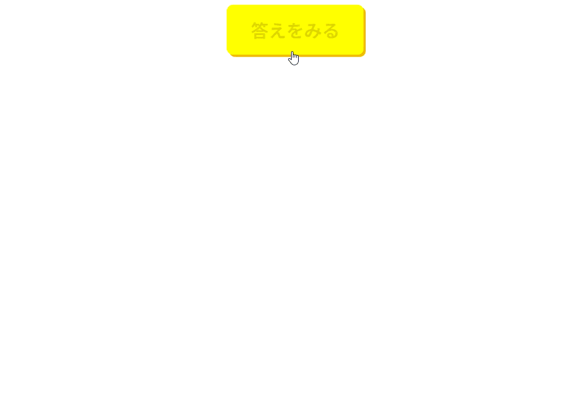

## ユーティリティ練習問題２

以下のHTML/CSSをみて、実行結果の通りになるようJavaScriptコードを追加してください。

```HTML
<!doctype html>
<html>
  <head>
    <title>Utility_2</title>
    <link rel="stylesheet" href="style.css" />
    <script src="script.js" defer></script>
  </head>

  <body>
    <button id="answer-button">答えをみる</button>
    <section id="modal">
      <h1>答え</h1>
      <p>時速3km。たかし君は家を出た時から同じ速度で進むとは限りません。</p>
      <p>柔軟な発想が求められる問題です。</p>
      <button id="close-button">閉じる</button>
    </section>
    <div id="mask"></div>
  </body>
</html>
```

```CSS
body{
  text-align: center;
}
button {
  font-size: 1.5rem;
  font-weight: bold;
  color: #aa0;
  background: #ee0;
  box-shadow: 3px 3px #eb0;
  border: none;
  border-radius: 0.5rem;
  padding: 1rem 2rem;
  cursor: pointer;
}
button:hover {
  color: #dd0;
  background: #ff0;
}
#mask {
  background: rgba(0, 0, 0, 0.6);
  position: fixed;
  inset: 0;
  z-index: 9998;
  opacity: 0;
  visibility: hidden;
}
#modal {
  background: #fff;
  max-width: 36rem;
  padding: 2rem;
  border-radius: 0.5rem;
  position: absolute;
  inset: 10rem 0 auto;
  margin: auto;
  z-index: 9999;
  opacity: 0;
  visibility: hidden;
}
```

[実行結果]
<br>


<details>
<summary>小ヒント💡</summary>

以下のイベントの時に関数を実行します。
- click : 要素をクリックしたときに関数を実行する

</details>

<details>
<summary>中ヒント💡💡</summary>

以下のメソッドを組み合わせて処理を実装します。
- querySelector() : 要素の取得
- addEventListener() : イベントの設定
- animate() : アニメーションの再生
- click() : 要素のclickイベントを発生させる

</details>

<details>
<summary>大ヒント💡💡💡</summary>

以下のような流れで処理を実装します。
```JS
// 1. answer-buttonというIDを持つbutton要素を取得
// 2. close-buttonというIDを持つbutton要素を取得
// 3. modalというIDを持つsection要素を取得
// 4. maskというIDを持つdiv要素を取得
// 5. 表示されるキーフレームを設定
// 6. 非表示になるキーフレームを設定
// 7. アニメーションの設定項目を追加
// 8. 1で取得したbutton要素にclickイベントを追加
// 8-1. 3と4で取得した要素を5と7の設定を使ってアニメーションを再生する
// 9. 2で取得したbutton要素にclickイベントを追加
// 9-1. 3と4で取得した要素を6と7の設定を使ってアニメーションを再生する
// 10. 4で取得したdiv要素にclickイベントを追加
// 10-1. 9のclickイベントを発生させる
```

</details>

<details>
<summary>解答例</summary>

```JS
const answerBtn = document.querySelector("#answer-button");
const closeBtn = document.querySelector("#close-button");
const modal = document.querySelector("#modal");
const mask = document.querySelector("#mask");
const showKeyframes = {
    opacity: [0, 1],
    visibility: "visible",
};
const hideKeyframes = {
    opacity: [1, 0],
    visibility: "hidden",
};
const options = {
    duration: 800,
    easing: "ease",
    fill: "forwards",
}

answerBtn.addEventListener("click", () => {
    modal.animate(showKeyframes, options);
    mask.animate(showKeyframes, options);
});

closeBtn.addEventListener("click", () => {
    modal.animate(hideKeyframes, options);
    mask.animate(hideKeyframes, options);
});

mask.addEventListener("click", () => {
    closeBtn.click();
});
```

</details>
