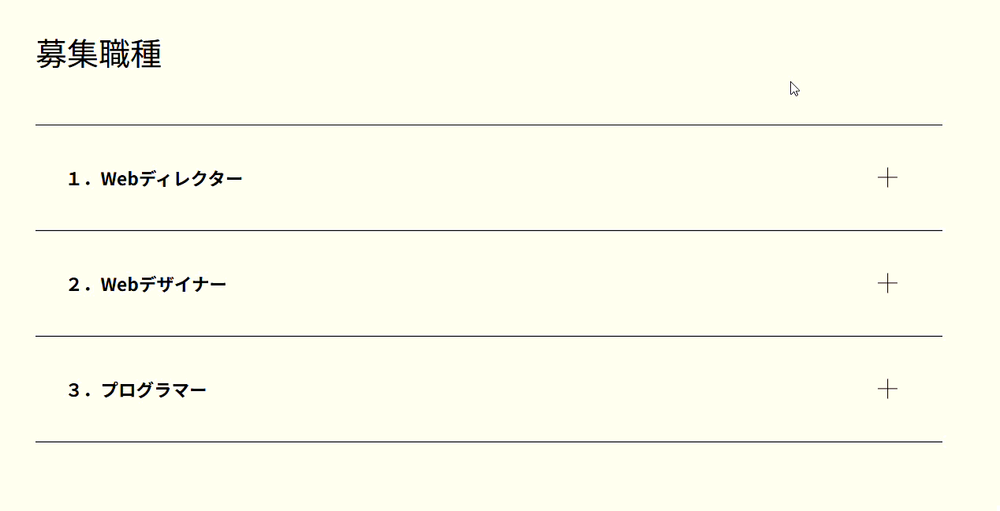

## ユーティリティ練習問題３

以下のHTML/CSSをみて、実行結果の通りになるようJavaScriptコードを追加してください。

```HTML
<!doctype html>
<html lang="ja">
  <head>
    <meta charset="utf-8" />
    <title>Utility_3</title>
    <meta name="viewport" content="width=device-width, initial-scale=1" />
    <link rel="stylesheet" href="https://unpkg.com/ress/dist/ress.min.css" />
    <link rel="stylesheet" href="style.css" />
    <script src="script.js" defer></script>
  </head>

  <body>
    <div class="content">
      <h2 class="title">募集職種</h2>
      <ul id="ac-menu">
        <li>
          <div class="label">１．Webディレクター</div>
          <div class="detail">
            <dl>
              <dt>仕事内容</dt>
              <dd>テキストテキストテキストテキスト</dd>
              <dt>応募資格</dt>
              <dd>テキストテキストテキストテキスト</dd>
              <dt>必須スキル</dt>
              <dd>テキストテキストテキストテキスト</dd>
              <dt>給与</dt>
              <dd>XXX万～XXX万 (スキル・経験・実績により優遇)</dd>
              <dt>休日・休暇</dt>
              <dd>
                土日祝祭日、有給休暇、夏季休暇、年末年始休暇、産前産後休暇、育児休暇
              </dd>
              <dt>雇用形態</dt>
              <dd>正社員（試用期間3ヶ月）<br />業務委託</dd>
              <dt>勤務時間</dt>
              <dd>フレックスタイム</dd>
              <dt>勤務地</dt>
              <dd>東京</dd>
            </dl>
          </div>
        </li>
        <li>
          <div class="label">２．Webデザイナー</div>
          <div class="detail">
            <dl>
              <dt>仕事内容</dt>
              <dd>テキストテキストテキストテキスト</dd>
              <dt>応募資格</dt>
              <dd>テキストテキストテキストテキスト</dd>
              <dt>必須スキル</dt>
              <dd>テキストテキストテキストテキスト</dd>
              <dt>給与</dt>
              <dd>XXX万～XXX万 (スキル・経験・実績により優遇)</dd>
              <dt>休日・休暇</dt>
              <dd>
                土日祝祭日、有給休暇、夏季休暇、年末年始休暇、産前産後休暇、育児休暇
              </dd>
              <dt>雇用形態</dt>
              <dd>正社員（試用期間3ヶ月）<br />業務委託</dd>
              <dt>勤務時間</dt>
              <dd>フレックスタイム</dd>
              <dt>勤務地</dt>
              <dd>東京</dd>
            </dl>
          </div>
        </li>
        <li>
          <div class="label">３．プログラマー</div>
          <div class="detail">
            <dl>
              <dt>仕事内容</dt>
              <dd>テキストテキストテキストテキスト</dd>
              <dt>応募資格</dt>
              <dd>テキストテキストテキストテキスト</dd>
              <dt>必須スキル</dt>
              <dd>テキストテキストテキストテキスト</dd>
              <dt>給与</dt>
              <dd>XXX万～XXX万 (スキル・経験・実績により優遇)</dd>
              <dt>休日・休暇</dt>
              <dd>
                土日祝祭日、有給休暇、夏季休暇、年末年始休暇、産前産後休暇、育児休暇
              </dd>
              <dt>雇用形態</dt>
              <dd>正社員（試用期間3ヶ月）<br />業務委託</dd>
              <dt>勤務時間</dt>
              <dd>フレックスタイム</dd>
              <dt>勤務地</dt>
              <dd>東京</dd>
            </dl>
          </div>
        </li>
      </ul>
    </div>
  </body>
</html>
```

```CSS
html {
  font-size: 100%;
}
body {
  background-color: #fffbef;
  color: #000;
}
ul {
  list-style: none;
}
.content {
  max-width: 960px;
  padding: 0 20px;
  margin: 100px auto;
}
.title {
  font-size: 2rem;
  font-weight: normal;
  margin-bottom: 50px;
}
#ac-menu li {
  border-top: solid 1px #000;
}
#ac-menu li:last-child {
  border-bottom: solid 1px #000;
}
#ac-menu .label {
  cursor:pointer;
  font-size: 1.125rem;
  font-weight: bold;
  padding: 40px 30px;
  position: relative;
  transition: .5s;
}
#ac-menu .label:hover {
  background-color: #ffda5f;
}
#ac-menu .label::before,
#ac-menu .label::after {
  content: '';
  width: 20px;
  height: 1px;
  background: #000;
  position: absolute;
  top: 50%;
  right: 5%;
  transform: translateY(-50%);
}
#ac-menu .label::after {
  transform: translateY(-50%) rotate(90deg);
  transition: .5s;
}
#ac-menu .label.open {
  background-color: #ffda5f;
}
#ac-menu .label.open::before {
  opacity: 0;
}
#ac-menu .label.open::after {
  transform: rotate(180deg);
}
#ac-menu .detail {
  border-top: solid 1px #ccc;
  overflow: hidden;
  height: 0;
  transition: height 0.2s ease-in-out;
}
#ac-menu .detail.open {
  height: auto;
}
#ac-menu .detail dl {
  padding: 35px 30px;
  display: flex;
  flex-wrap: wrap;
}
#ac-menu .detail dt {
  width: 20%;
  font-weight: bold;
  margin-bottom: 40px;
}
#ac-menu .detail dd {
  width: 80%;
  margin-bottom: 40px;
}
```

[実行結果]
<br>


<details>
<summary>小ヒント💡</summary>

以下のイベントの時に関数を実行します。
- click : 要素をクリックしたときに関数を実行する

</details>

<details>
<summary>中ヒント💡💡</summary>

以下のメソッドを組み合わせて処理を実装します。
- querySelectorAll() : 複数要素の取得
- foreach() : コレクションの繰り返し処理
- addEventListener() : イベントの設定
- toggle() : クラスの追加/削除の切り替え
- contains() : 該当のクラスが存在しているかどうかを調べる

</details>

<details>
<summary>大ヒント💡💡💡</summary>

以下のような流れで処理を実装します。
```JS
// 1. #ac-menu .labelのクラスを持つ複数のdiv要素を取得
// 2. 1で取得した要素に繰り返し処理を行う
// 2-1. 取り出した要素にclickイベントを追加する
// 2-2. 2-1の要素にopenクラスを追加/削除する
// 2-3. 要素の次のdiv要素を取得
// 2-4. 2-3の要素にopenクラスを追加/削除する
// 2-5. 2-3の要素にopenクラスがある場合 => a
// 2-5-a. 2-3の要素のheightにscrollHeightを設定する
// 2-5. それ以外の場合 => b
// 2-5-b. 2-3の要素のheightにnullを設定する
```

</details>

<details>
<summary>解答例</summary>

```JS
const labels = document.querySelectorAll("#ac-menu .label");
labels.forEach(label => {
    label.addEventListener("click", () => {
        label.classList.toggle("open");

        const detail = label.nextElementSibling;
        detail.classList.toggle("open");
        if (detail.classList.contains("open")) {
            detail.style.height = `${detail.scrollHeight}px`;
        } else {
            detail.style.height = null;
        }
    });
});
```

</details>
