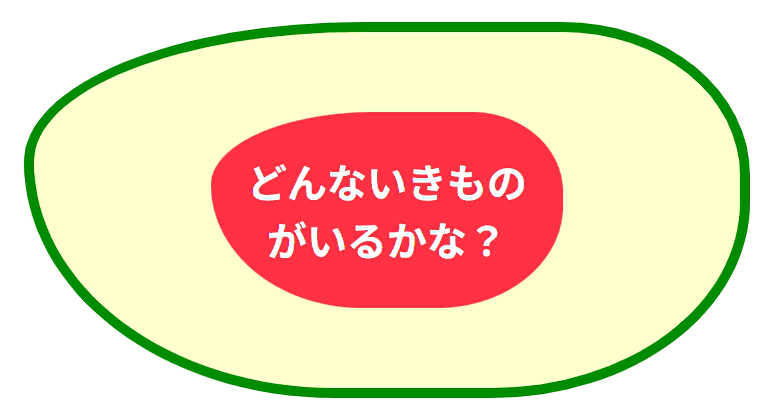

## アニメーション練習問題４

以下のHTML/CSSをみて、実行結果の通りになるようJavaScriptコードを追加してください。

```HTML
<!doctype html>
<html lang="ja">
  <head>
    <meta charset="UTF-8" />
    <meta name="viewport" content="width=device-width, initial-scale=1.0" />
    <title>Animation_4</title>
    <link rel="stylesheet" href="style.css">
    <script src="script.js" defer></script>
  </head>
  <body>
    <h1 id="floating-label"><span id="floating-text">どんないきものがいるかな？</span></h1>
  </body>
</html>
```

```CSS
body {
    text-align: center;
}
h1 {
    background: #ffc;
    color: #fff;
    border: 8px solid #080;
    display: inline-block;
    padding: 4rem 2rem;
    width: 80%;
}
span {
    background: #f34;
    display: inline-block;
    padding: 2rem 1rem;
    width: 50%;
}
```

[実行結果]
<br>


<details>
<summary>解答例</summary>

```JS
const floatingLabel = document.querySelector("#floating-label");
const floatingText = document.querySelector("#floating-text");

const keyframes = {
    borderRadius: [
        '20% 50% 50% 70%/50% 50% 70% 50%',
        '50% 20% 50% 50%/40% 40% 60% 60%',
        '50% 40% 20% 40%/40% 50% 50% 80%',
        '50% 50% 50% 20%/40% 40% 60% 60%'
    ],
};
const options = {
    duration: 8000,
    direction: 'alternate',
    iterations: Infinity
};

floatingLabel.animate(keyframes, options);
floatingText.animate(keyframes, options);
```

</details>
