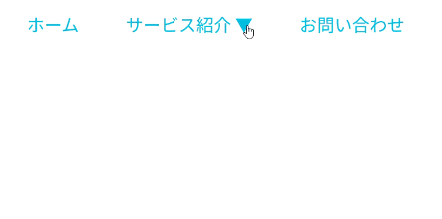

## ナビゲーション練習問題１

以下のHTML/CSSをみて、実行結果の通りになるようJavaScriptコードを追加してください。

```HTML
<!doctype html>
<html lang="ja">
  <head>
    <meta charset="UTF-8" />
    <meta name="viewport" content="width=device-width, initial-scale=1.0" />
    <title>Navigation_1</title>
    <link rel="stylesheet" href="style.css" />
    <script src="script.js" defer></script>
  </head>
  <body>
    <ul class="menu menu-click">
      <li><a href="#">ホーム</a></li>
      <li>
        <a href="#">サービス紹介▽</a>
        <ul class="sub-menu">
          <li><a href="#">Webサイト制作</a></li>
          <li><a href="#">デザイン</a></li>
          <li><a href="#">イベント運営</a></li>
        </ul>
      </li>
      <li><a href="#">お問い合わせ</a></li>
    </ul>
  </body>
</html>
```

```CSS
.menu {
    position: relative;
    list-style: none;
    display: flex;
    gap: 3rem;
    font-size: 1.5rem;
}
.menu a {
    color: #0bd;
    padding: 0.5rem;
    text-decoration: none;
    transition: color 0.4s;
}
.sub-menu {
    position: absolute;
    z-index: 2;
    top: 2.5rem;
    padding: 0;
    list-style: none;
    background: #0bd;
    font-size: 1rem;
}
.sub-menu a {
    display: block;
    padding: 1rem 2rem;
    color: #fff;
}
.sub-menu a:hover {
    background-color: #05b;
}
.menu-click .sub-menu {
    transition: scale 0.4s;
    transform-origin: center top;
    scale: 1 0;
}
.menu-click .sub-menu.active {
    scale: 1;
}
```

[実行結果]
<br>


<details>
<summary>解答例</summary>

```JS
const menuItems = document.querySelectorAll(".menu li:has(> .sub-menu)");

menuItems.forEach((item) => {
    item.addEventListener("click", (e) => {
        e.preventDefault();

        const subMenu = item.querySelector(".sub-menu");
        if (subMenu) {
            subMenu.classList.toggle("active");
        }
    })
});
```

</details>
