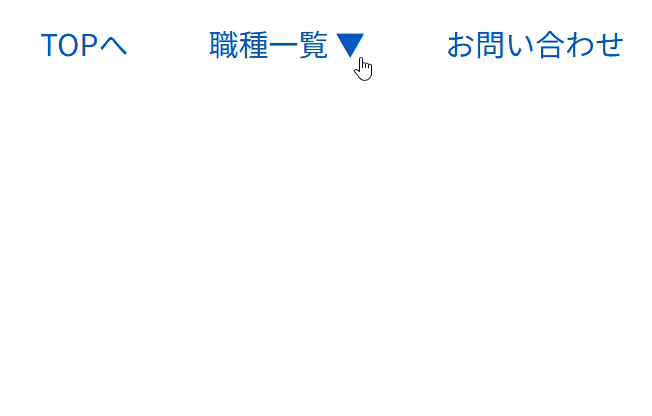

## ナビゲーション練習問題１

以下のHTML/CSSをみて、実行結果の通りになるようJavaScriptコードを追加してください。

```HTML
<!doctype html>
<html lang="ja">
  <head>
    <meta charset="UTF-8" />
    <meta name="viewport" content="width=device-width, initial-scale=1.0" />
    <title>Navigation_1</title>
    <link rel="stylesheet" href="style.css" />
    <script src="script.js"></script>
  </head>
  <body>
    <ul class="menu menu-click">
      <li><a href="#">TOPへ</a></li>
      <li>
        <a href="#">職種一覧&nbsp;<span id="symbol">▼</span></a>
        <ul class="sub-menu">
          <li><a href="#">Webエンジニア</a></li>
          <li><a href="#">インフラエンジニア</a></li>
          <li><a href="#">UI/UXデザイナー</a></li>
          <li><a href="#">イベント運営スタッフ</a></li>
        </ul>
      </li>
      <li><a href="#">お問い合わせ</a></li>
    </ul>
  </body>
</html>
```

```CSS
.menu {
    position: relative;
    list-style: none;
    display: flex;
    gap: 3rem;
    font-size: 1.5rem;
}
.menu a {
    color: #05b;
    padding: 0.5rem;
    text-decoration: none;
}
.sub-menu {
    position: absolute;
    z-index: 2;
    top: 2.5rem;
    padding: 0;
    list-style: none;
    background: #5bd;
    font-size: 1rem;
}
.sub-menu a {
    display: block;
    padding: 1rem 2rem;
    color: #fff;
}
.sub-menu a:hover {
    background-color: #05b;
}
.menu-click .sub-menu {
    transition: scale 0.2s;
    transform-origin: center top;
    scale: 1 0;
}
.menu-click .sub-menu.active {
    scale: 1;
}
```

[実行結果]
<br>


<details>
<summary>小ヒント💡</summary>

以下のイベントの時に関数を実行します。

- DOMContentLoaded : HTML文書などがすべて読み込まれたときに関数を実行する
- click : ナビゲーションメニューの要素がクリックされたときに関数を実行する

</details>

<details>
<summary>中ヒント💡💡</summary>

以下のメソッドを組み合わせて処理を実装します。
- addEventListener() : イベント発生時に関数を実行させる
- querySelector() : 要素の取得
- querySelectorAll() : 全要素の取得
- foreach() :  配列などのコレクションに繰り返し処理をする
- preventDefault() : デフォルトの操作を無効化する
- toggle() : クラスのオンとオフを切り替える
- contains() : クラスに要素が含まれているか調べる

</details>

<details>
<summary>大ヒント💡💡💡</summary>

以下のような流れで処理を実装します。
```JS
// 1. DOMContentLoadedのイベント発生時に実行する関数を定義
// 1-1. symbolというIDを持つ要素を取得する
// 1-2. menuクラスを持つ要素下でsub-menuというクラスを持つli要素を全て取得する
// 1-3. 1-2で取得した要素に繰り返し処理を行う
// 1-3-1. li要素にclickイベント発生時に実行する関数を定義
// 1-3-2. click発生時のデフォルト操作は無効化する
// 1-3-3. li要素下のsub-menuというクラスを持つ要素を取得する
// 1-3-4. 1-3-3で取得した要素が存在すれば
// 1-3-4-1. activeクラスを切り替える
// 1-3-4-2. activeがオンになっていれば1-1で取得した要素のtextContentを切り替える
```

</details>

<details>
<summary>解答例</summary>

```JS
document.addEventListener('DOMContentLoaded', () => {
    const symbol = document.querySelector("#symbol");
    const menuItems = document.querySelectorAll(".menu li:has(> .sub-menu)");

    menuItems.forEach((item) => {
        item.addEventListener("click", (e) => {
            e.preventDefault();
            const subMenu = item.querySelector(".sub-menu");
            if (subMenu) {
                subMenu.classList.toggle("active");

                const isActive = subMenu.classList.contains("active");
                symbol.textContent = isActive ? "△" : "▼";
            }
        })
    });
});
```

</details>
