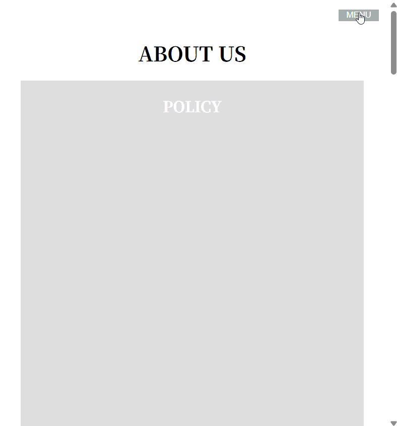

## ナビゲーション練習問題２

以下のHTML/CSSをみて、実行結果の通りになるようJavaScriptコードを追加してください。

```HTML
<!doctype html>
<html lang="ja">
  <head>
    <meta charset="UTF-8" />
    <meta name="viewport" content="width=device-width, initial-scale=1.0" />
    <title>Navigation_2</title>
    <link rel="stylesheet" href="style.css" />
    <script src="script.js" defer></script>
  </head>
  <body>
    <header id="header">
      <button id="menu-open" class="btn-menu">MENU</button>
      <div class="menu-container">
        <button id="menu-close" class="btn-menu">✕</button>
        <ul class="menu">
          <li><a href="#policy">POLICY</a></li>
          <li><a href="#history">HISTORY</a></li>
          <li><a href="#company">COMPANY</a></li>
          <li><a href="#our-future">OUR FUTURE</a></li>
          <li><a href="#access">ACCESS</a></li>
        </ul>
      </div>
    </header>

    <article>
      <h1>ABOUT US</h1>
      <div class="article-content">
        <h2 id="policy">POLICY</h2>
      </div>
      <div class="article-content">
        <h2 id="history">HISTORY</h2>
      </div>
      <div class="article-content">
        <h2 id="company">COMPANY</h2>
      </div>
      <div class="article-content">
        <h2 id="our-future">OUR FUTURE</h2>
      </div>
      <div class="article-content">
        <h2 id="access">ACCESS</h2>
      </div>
    </article>
  </body>
</html>
```

```CSS
body {
    font-family: serif;
    text-align: center;
}
.btn-menu {
    position: fixed;
    right: 1rem;
    top: 1rem;
    z-index: 1;
    padding: auto;
    color: #fff;
    background: #aaa;
    width: 64px;
    cursor: pointer;
    border: 0;
    transition: 0.4s;
}
#menu-close {
    z-index: 3;
}
.menu-container {
    position: fixed;
    top: 0;
    left: 0;
    z-index: 2;
    width: 100%;
    height: 100vh;
    background: #eee;
    opacity: 0;
    display: flex;
    align-items: center;
    justify-content: center;
    visibility: hidden;
    transition: 0.4s;
}
.menu {
    list-style: none;
    text-align: center;
}
.menu a {
    color: #000;
    display: block;
    padding: 1.5rem;
    font-size: 2rem;
    text-decoration: none;
    transition: color 0.4s;
}
.menu a:hover {
    color: #05b;
}
.panel-open {
    opacity: 1;
    visibility: visible;
}
article {
    max-width: 800px;
    margin: auto;
    padding: 2rem;
}
.article-content {
    padding-top: 0.2rem;
    margin-bottom: 2rem;
    background-color: #ddd;
    color: #fff;
    height: 800px;
}
```

[実行結果]
<br>


<details>
<summary>解答例</summary>

```JS
const openBtn = document.querySelector("#menu-open");
const closeBtn = document.querySelector("#menu-close");
const menuPanel = document.querySelector(".menu-container");
const menuLinks = document.querySelectorAll(".menu a");

openBtn.addEventListener("click", () => {
    menuPanel.classList.add("panel-open");
});

closeBtn.addEventListener("click", () => {
    menuPanel.classList.remove("panel-open");
});

menuLinks.forEach(link => {
    link.addEventListener("click", () => {
        menuPanel.classList.remove("panel-open");
    });
});
```

</details>
