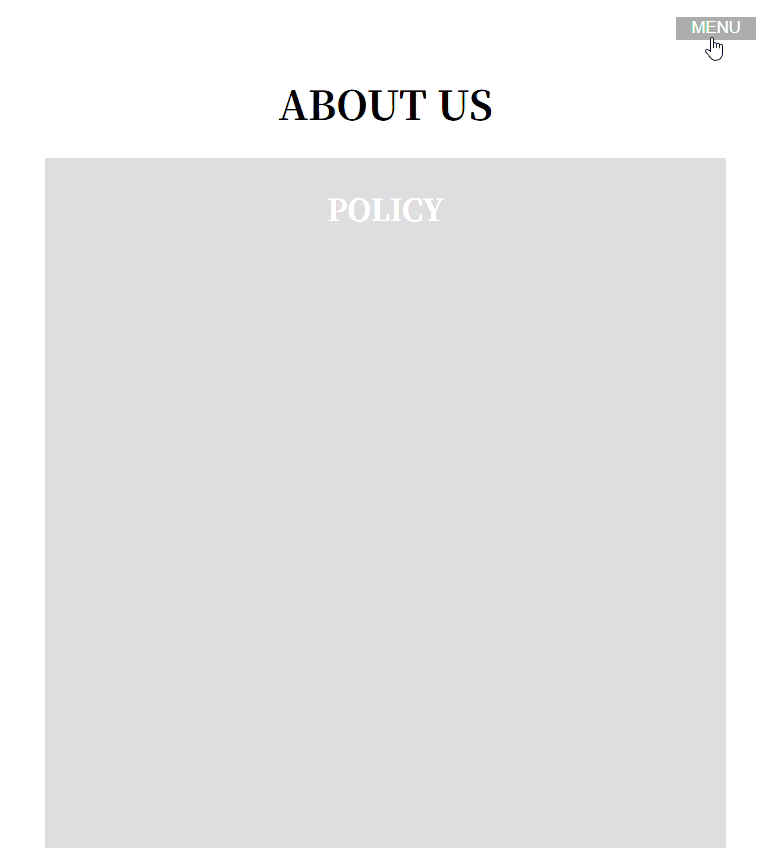

## ナビゲーション練習問題３

以下のHTML/CSSをみて、実行結果の通りになるようJavaScriptコードを追加してください。

```HTML
<!doctype html>
<html lang="ja">
  <head>
    <meta charset="UTF-8" />
    <meta name="viewport" content="width=device-width, initial-scale=1.0" />
    <title>Navigation_3</title>
    <link rel="stylesheet" href="style.css" />
    <script src="script.js"></script>
  </head>
  <body>
    <header id="header">
      <button id="menu-open" class="btn-menu">MENU</button>
      <div class="menu-container">
        <button id="menu-close" class="btn-menu">✕</button>
        <ul class="menu">
          <li><a href="#">TOP</a></li>
          <li><a href="#policy">POLICY</a></li>
          <li><a href="#history">HISTORY</a></li>
          <li><a href="#company">COMPANY</a></li>
          <li><a href="#our-future">OUR FUTURE</a></li>
          <li><a href="#access">ACCESS</a></li>
        </ul>
      </div>
    </header>

    <article>
      <h1>ABOUT US</h1>
      <div class="article-content">
        <h2 id="policy">POLICY</h2>
      </div>
      <div class="article-content">
        <h2 id="history">HISTORY</h2>
      </div>
      <div class="article-content">
        <h2 id="company">COMPANY</h2>
      </div>
      <div class="article-content">
        <h2 id="our-future">OUR FUTURE</h2>
      </div>
      <div class="article-content">
        <h2 id="access">ACCESS</h2>
      </div>
    </article>
  </body>
</html>
```

```CSS
body {
    font-family: serif;
}
.btn-menu {
    position: fixed;
    right: 1rem;
    top: 1rem;
    z-index: 1;
    padding: auto;
    color: #fff;
    background: #aaa;
    width: 64px;
    cursor: pointer;
    border: 0;
    transition: 0.4s;
}
#menu-close {
    z-index: 3;
}
.menu-container {
    position: fixed;
    top: 0;
    right: 0;
    z-index: 2;
    width: 300px;
    height: 100vh;
    background: #eee;
    box-shadow: 0 0 20px rgba(0, 0, 0, 0.3);
    translate: 320px 0;
    transition: translate 0.4s;
}
.menu {
    list-style: none;
    padding-top: 6rem;
}
.menu a {
    color: #000;
    display: block;
    padding: 1rem;
    font-size: 1.5rem;
    text-decoration: none;
    transition: color 0.4s;
}
.menu a:hover {
    color: #05b;
}
.panel-open {
    translate: 0;
}
article {
    text-align: center;
    max-width: 800px;
    margin: auto;
    padding: 2rem;
}
.article-content {
    padding-top: 0.2rem;
    margin-bottom: 2rem;
    background-color: #ddd;
    color: #fff;
    height: 800px;
}
```

[実行結果]
<br>


<details>
<summary>小ヒント💡</summary>

以下のイベントの時に関数を実行します。

- DOMContentLoaded : HTML文書などがすべて読み込まれたときに関数を実行する
- click : ナビゲーションメニューの要素がクリックされたときに関数を実行する

</details>

<details>
<summary>中ヒント💡💡</summary>

以下のメソッドを組み合わせて処理を実装します。
- addEventListener() : イベント発生時に関数を実行させる
- querySelector() : 要素の取得
- add() : クラスを追加する
- remove() : クラスを取り除く

</details>

<details>
<summary>大ヒント💡💡💡</summary>

以下のような流れで処理を実装します。
```JS
// 1. DOMContentLoadedのイベント発生時に実行する関数を定義
// 1-1. menu-openというIDを持つボタン要素を取得
// 1-2. menu-closeというIDを持つボタン要素を取得
// 1-3. menu-containerというクラスを持つ要素を取得
// 1-4. 1-1で取得したボタン要素にclickイベントを追加
// 1-4-1. 1-3で取得した要素のクラスにpanel-openを追加
// 1-5. 1-2で取得したボタン要素にclickイベントを追加
// 1-5-1. 1-3で取得した要素のクラスからpanel-openを取り除く
```
</details>

<details>
<summary>解答例</summary>

```JS
document.addEventListener('DOMContentLoaded', () => {
    const openBtn = document.querySelector("#menu-open");
    const closeBtn = document.querySelector("#menu-close");
    const menuPanel = document.querySelector(".menu-container");

    openBtn.addEventListener("click", () => {
        menuPanel.classList.add("panel-open");
    });

    closeBtn.addEventListener("click", () => {
        menuPanel.classList.remove("panel-open");
    });
});
```

</details>
